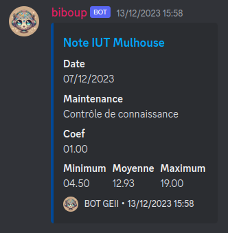
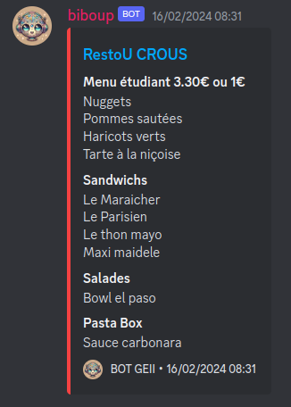

# Discord Bot UHA

A personal bot for Discord that sends **new class notes** and meals from the **Crous restaurant**.

## Description
- Scrapes data every 10 minutes from [UHA notes](https://notes.iutmulhouse.uha.fr/) after logging in. It compares the scraped data with the previous notes database. If a new note is detected, it sends it in an embellished message to a specific Discord channel. More details on how UHA notes scraping works can be found [here](./uha_scraping_wiki.MD).
- Scrapes data every day at 8 am from [Crous Restaurant](https://www.crous-strasbourg.fr/restaurant/resto-u-de-liut-mulhouse-2). The meal is then sent in an embellished message to a specific Discord channel.

<p align="center">
     
    
</p>

## Getting Started

### 1. Clone the repository
Clone the repository
```
git clone https://github.com/arduilex/discord_bot_uha.git
```
On Linux, you need to create a virtual environment for Python:
```bash
cd discord_bot_uha
python -m venv .venv
source .venv/bin/activate
``` 
### 2. Install dependencies
```bash
pip install -r requirements.txt
```
`requirements.txt` includes :
* [Discord.py](https://discordpy.readthedocs.io/) for the bot
* [Selenium](https://selenium-python.readthedocs.io/) for the scraping

### 3. Set up environment variables

Rename `.env.example` to `.env` and add your UHA **login**, Discord **channel ID**, etc.

### 4. Choose your browser

Depending on what browser you have installed on your pc, you need to edit `src/scraping/selenium_driver.py`. By default, it's already set up for Chromium. If you use Firefox, simply comment and uncomment the appropriate lines.

### 5. Executing the program

In your terminal, at the root of your local repository, run the following programs:

- Run Discord bot
```
python src/main_bot.py &
```
`main_bot.py` communicates with other main modules through sockets. (See `HOST` and `PORT` in `.env`)
- Run notes scraping
```
python src/main_notes.py &
```
- Run crous meal scraping
```
python src/main_crous.py &
```
`&` runs Python in the background. You can see the process with `ps` and kill it with `kill [process_id]` or `pkill [process_name]`

## Debugging

To see scraping in your computer (not in a server), simply delete this line in the files of the **scraping** folder:
```
options.add_argument('--headless')
```

## Authors

This project was entirely made by me.

- Email: alexandre@r3tro.fr
- Discord: `@arduilex`

## Versions
* [v1.1](https://github.com/arduilex/discord_bot_uha/releases/tag/1.1)
    * Replace the notes scraping by a simple POST to the API.
* [v1.0](https://github.com/arduilex/discord_bot_uha/releases/tag/1.0)
    * Split notes and crous in two distinct programs.
* v0.2
    * Add scraping for Crous Mulhouse Restaurant
* [legacy](https://github.com/arduilex/discord_bot_uha/tree/legacy)
    * You can find my very old version here, it works with Java Script, the process is very crappy.

## License
This project is licensed under no license. Feel free to steal my work :)
